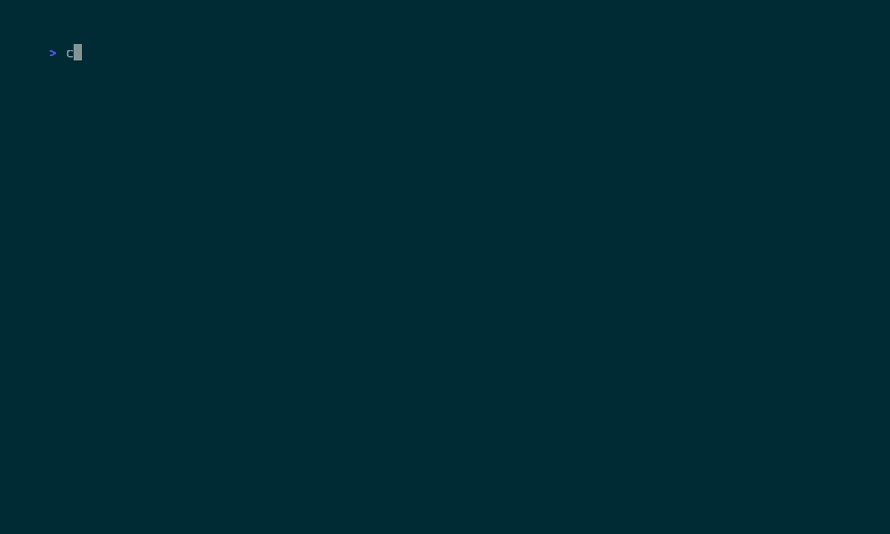

# runmatrix

`runmatrix` is a small DAG-first experiment runner for local workflows.

Try it without installing:

```bash
uvx --from git+https://github.com/agustif/runmatrix runmatrix inspect examples/basic.yaml
```

It takes the useful semantics from CI systems:

- `tasks` like jobs
- `needs` for DAG edges
- `matrix` expansion
- reusable defaults
- bounded parallel execution

and keeps only the local execution kernel.

It does **not** try to be:

- a hosted platform
- a tracking backend
- a distributed scheduler
- an ML-specific framework

## Demo



## Why this exists

Most experiment tools are either:

- too small to express real DAGs
- or too large and platform-shaped to reuse cleanly

`runmatrix` is the narrow reusable wedge:

- manifests
- planning
- execution
- hooks

## Mental model

Think of it as:

- GitHub Actions workflows
- but local
- and much smaller

The stable concepts are:

1. `tasks`
2. `needs`
3. `matrix`
4. `defaults`
5. hooks

Everything else should compile down to those.

## Current features

- canonical manifest/domain models
- YAML / JSON / TOML loaders
- matrix expansion
- dependency validation
- stage planning
- sequential shell execution
- hook interface
- console sink with animated in-flight task status, raw live stdout/stderr streaming (line-buffered), and summary panels
- minimal Textual shell
- width-aware plan rendering with:
  - stage table
  - DAG tree

## Installation

Recommended for normal use:

### uv tool

```bash
uv tool install runmatrix
```

### pipx

```bash
pipx install runmatrix
```

### pip

```bash
pip install runmatrix
```

### From source (development)

```bash
git clone https://github.com/agustif/runmatrix.git
cd runmatrix
uv sync
```

## Quick start

Show the plan:

```bash
runmatrix inspect examples/basic.yaml
```

Run it:

```bash
runmatrix run examples/basic.yaml
```

or simply:

```bash
runmatrix examples/basic.yaml
```


## Example manifest

```yaml
defaults:
  PROFILE: smoke

tasks:
  - id: baseline
    command: echo baseline
    env:
      RUN_ID: baseline

  - id: sweep
    command: echo sweep
    needs: [baseline]
    matrix:
      strategy: zip
      name_prefix: sweep
      params:
        RUN_ID: [s1, s2]
        WIDTH: ["256", "384"]
```

## Documentation

- [docs/ARCHITECTURE.md](docs/ARCHITECTURE.md)
- [docs/CLI.md](docs/CLI.md)
- [docs/MANIFESTS.md](docs/MANIFESTS.md)
- [docs/PLUGINS.md](docs/PLUGINS.md)
- [docs/ROADMAP.md](docs/ROADMAP.md)

## Checks

```bash
uv run ruff check runmatrix tests
uv run ty check
uv run pytest
```

## Demo regeneration

```bash
vhs demo/runmatrix.tape
```
